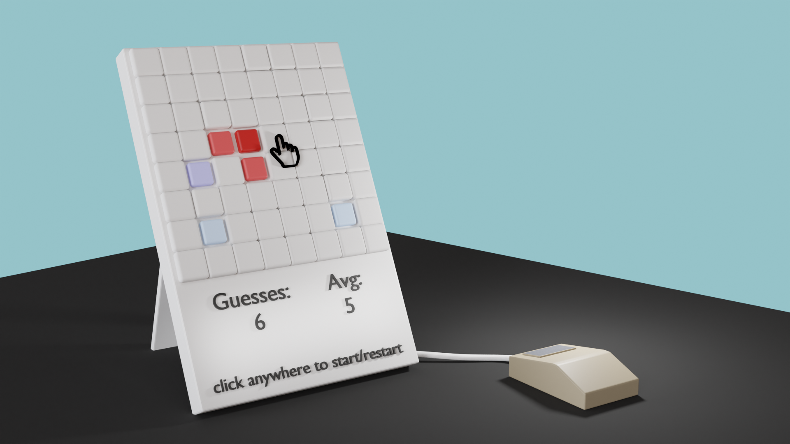
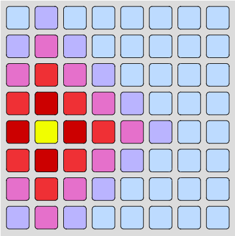
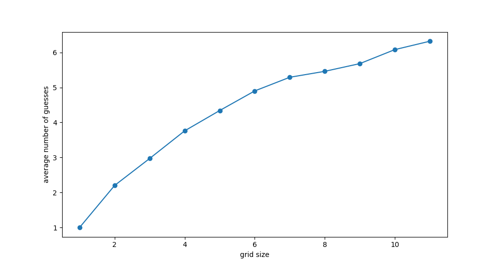

# tile-guesser

## Play it [HERE](https://tiles.artomweb.com)

A game consisting of an 8x8 grid where the player attempts to select the yellow square. After selecting a square, it's colour is revealed, the closer the color is to red, the closer it is to the yellow square.

The colors are computed using the Manhattan distance of that square to the yellow square.

## A graph of grid size vs average number of guesses

